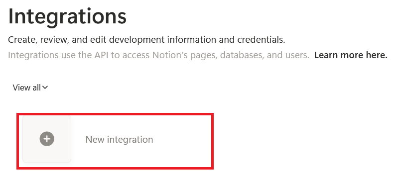
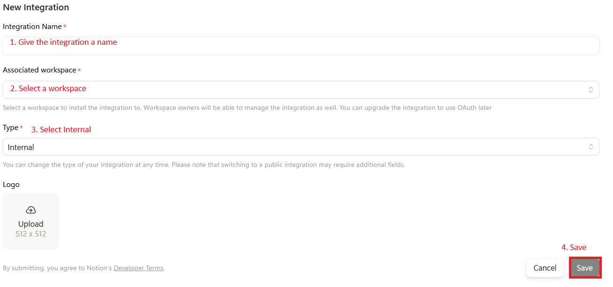
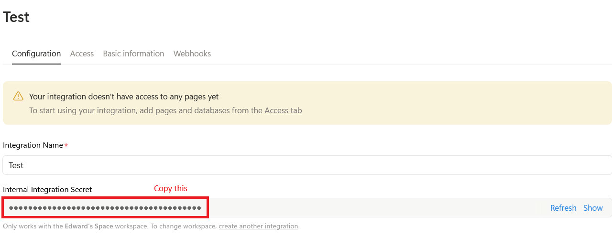
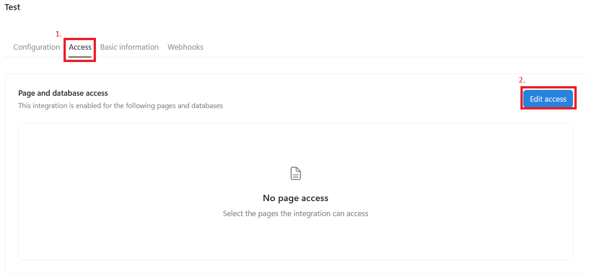
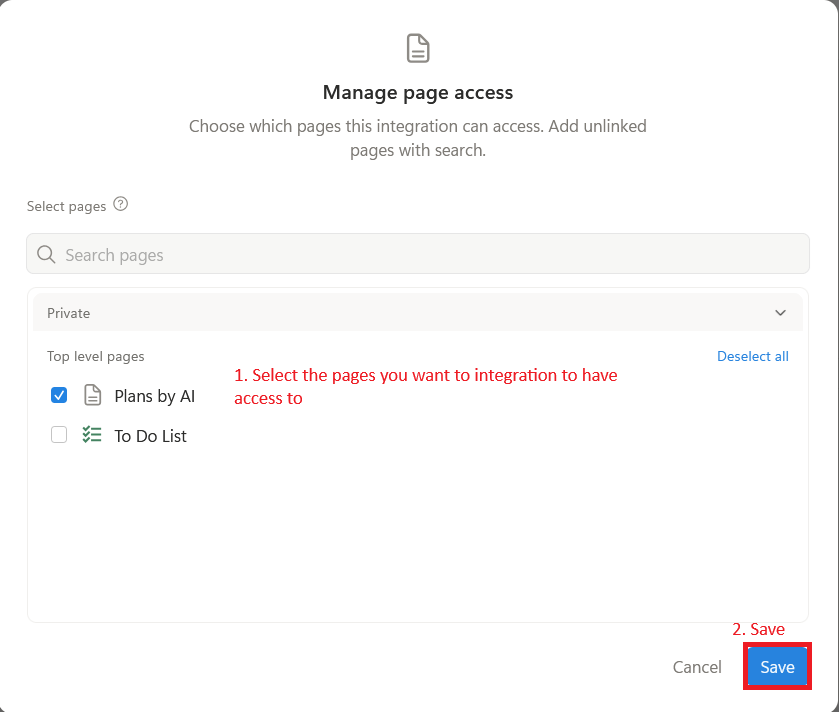
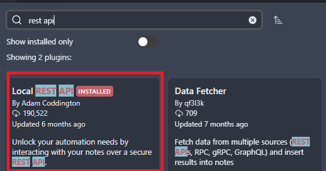
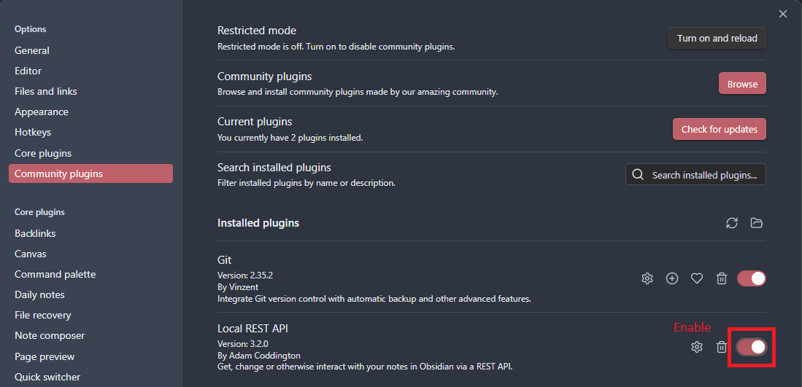
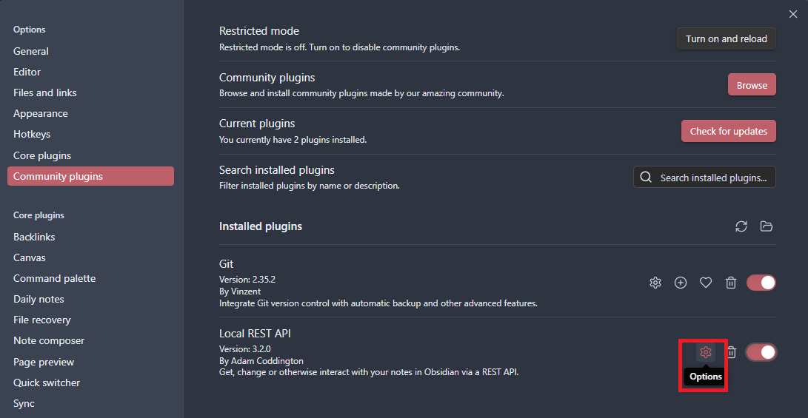
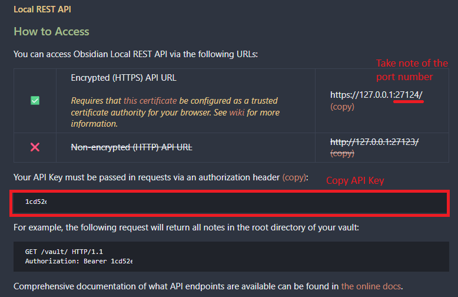

# Kaggle Gen AI Capstone Project - Project Pathfinder

## Introduction

This is my submission for Kaggle's Agents Intensive Capstone Project as part of the [5 Day Gen AI Intensive Course with Google](https://www.kaggle.com/learn-guide/5-day-genai).

This project features a basic TUI chat interface that allows user to interact with a root agent created with [Google ADK](https://google.github.io/adk-docs/).

These are the primary capabilities of the agent:

1. Generate travel itinerary.
2. Generate plans for achieving personal goals.
3. Save generated plans to either Notion or local Obsidian vault.

There is one root agent repsonsible for directly communuicating with users, and delegating the tasks to the appropriate sub-agents.

**Sub-agent: Travel Planner agent**
This agent is responsible for generating a travel itinerary. It will asks questions if necessary to generate a travel itinerary that fits the user's requirements. It is also responsible for handling any user requested changes to the itinerary.

**Sub-agent: Goal Planner agent**
This agent is used for generating plans to help user achieve specific goals. It will asks questions if necessary to generate a plan that fits the user's requirements. It is also responsible for handling any user requested changes to the plan.

**Sub-agent: Notion agent**
Once a plan has been approved, user can choose to upload the plan to a new page on their Notion workspace. This agent has two function tools: one for creating a new page with the plan, one for searching notes. To create a page on Notion, you need to place the page under an existing parent note. This can be done by providing the parent page ID to the agent, or by providing the title of the parent page.

I originally tried to make this agent use the Notion MCP server. Setting up the agent to use the MCP server is easy. BUT, I have trouble making the agent create a new page and insert complex contents into the new page with the MCP server. Creating an empty page with simple contents work, but for more complex markdown contents, it rarely works.

I have to switch to using md2notion and notion-client and expose functions for uploading markdown contents to new page and for searching pages. The agent is now able to complete the page creation operation more reliable since switching to using function tools.

**Sub-agent: Obsidian agent**
Once a plan has been approved, user can choose to upload the plan to a new note on their Obsidian vault. This agent is using a [McpToolset](https://google.github.io/adk-docs/tools-custom/mcp-tools/) for interacting with Obsidian MCP server.

## Environment Setup

### 1. Prerequisites

- Make sure you have at least [Python 3.10](https://www.python.org/downloads/) installed on your environment. This is important as [Google ADK for Python v1.19.0](https://github.com/google/adk-python/releases/tag/v1.19.0) requires Python 3.10 or higher to function properly.

### 2. Download

Download the project to your working directory, or you can just use `git clone`.

```
git clone https://github.com/dwardTheNerd/KaggleGenAICapstoneProject.git
```

### 3. Setting up a Virtual Environment

#### 1. Create virtual environment
Create a virtual environment in your working directory. If you do not have venv, you need to install it for the version of Python you are using.

```bash
python3 -m venv .venv
```

#### 2. Activate Virtual Environment

**macOS/Linux:**

```bash
source .venv/bin/activate
```

**Windows (Command Prompt)**:

```cmd
.venv\Scripts\activate.bat
```

**Windows (PowerShell)**:

```PowerShell
.venv\Scripts\Activate.ps1
```

#### 3. Installing Dependencies

Choose either options:

**Option A: Using pip and requirements.txt:**

```bash
pip install --upgrade pip
pip install -r requirements.txt
  ```

**Option B: Using pip and Editable Install:**

```bash
pip install --upgrade pip
pip install -e .
```

## Obtaining API Keys

### Google API Key

Obtain API key from [Google AI Studio](https://aistudio.google.com/)

#### 1. Go to AI Studio


#### 2. Create API Key


#### 3. Copy API Key


### Notion Token ###

[Notion](https://www.notion.com) is an all-in-one productivity and workspace app that combines note-taking, task management, project planning, and AI-powered tools into a single customizable platform.

A Notion API key or token is required for the agent to create new Notion pages. Go to (https://www.notion.so/profile/integrations) to set up a new **internal** integration.

#### 1. Create internal integration





#### 2. Copy secret from the integration's settings page



#### 3. Configure Capabilities


#### 4. Configure Access





### Obsidian API Key ###

[Obsidian](https://obsidian.md/) is a popular note-taking and personal knowledge base tool.

For the agent to create notes in your local Obsidian vault, you need to install and run the [Obsidian REST API community plugin](https://github.com/coddingtonbear/obsidian-local-rest-api).

#### 1. Install REST API community plugin in Obsidian



#### 2. Enable REST API community plugin



#### 4. Access REST API settings



#### 5. Copy API Key and port number



## Configuration

1. In pathfinder folder, rename `.env.example` to `.env`
2. Open `.env`
3. Provide GOOGLE_APY_KEY:

  ```
  GOOGLE_API_KEY=PROVIDE GOOGLE_API_KEY HERE
  ```

4. Provide NOTION_TOKEN:

  ```
  NOTION_TOKEN=PROVIDE NOTION_TOKEN HERE
  ```

5. Provide OBSIDIAN_API_KEY, OBSIDIAN_HOST and OBSIDIAN_PORT:

  ```
  OBSIDIAN_API_KEY=PROVIDE OBSIDIAN_API_KEY HERE
  OBSIDIAN_HOST=PROVIDE OBSIDIAN_HOST
  OBSIDIAN_PORT=PROVIDE OBSIDIAN_PORT
  ```

  `OBSIDIAN_HOST` should be where you are running Obsidian.

  6. Save changes

## Running the Project

To run the project, make sure you are in the **KaggleGenAICapstoneProject** folder and not in the pathfinder folder, then run the following:

```bash
python3 -m pathfinder.main
```

## Debugging

The TUI application and Google ADK utilize Python's logging package for collecting logs. Logs are configured to output to `.log` files under the logs folder.

For more visibility into the agent's and sub-agents' operations, you can change the logging_level in `config.json`.

Change logging_level to **DEBUG**:

```json
{
  "logging_level": "DEBUG"
}
```

## Special Thanks

I relied very heavily on the following resources while working on this project. I will like to give my appreciation to the authors of the following resources:

- **Piotr Tobiasz** for his guide on [The Chaotic Engineer](https://chaoticengineer.hashnode.dev/textual-and-chatgpt) on how to create a chat interface in TUI.

- **Guillaume Gelin** for his [notion-client](https://github.com/ramnes/notion-sdk-py) Python package. His project makes it so much easier to use Notion API.

- **Marko Manninen** for his [md2notionpage](https://github.com/markomanninen/md2notion) Python package. Without the package, I likely will have to spend more time trying to figure out how to navigate around Notion's API and rate limits.