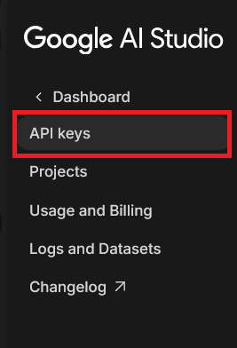
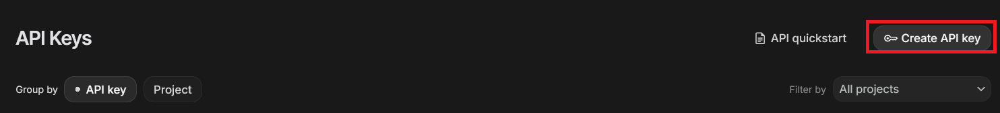
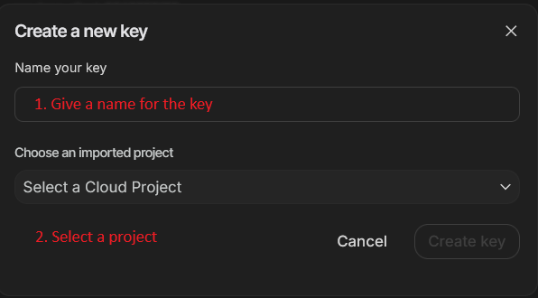
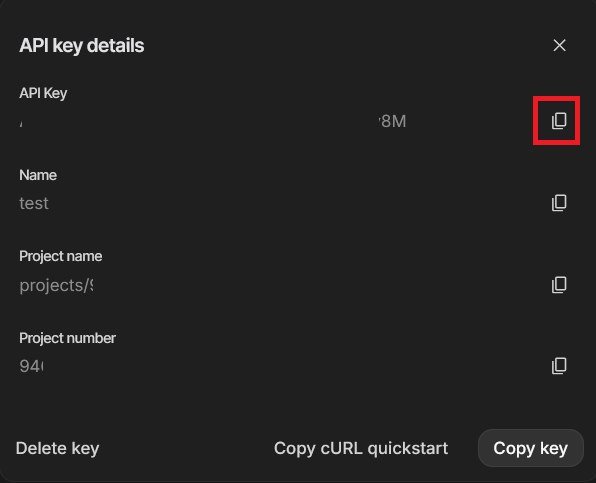

# Kaggle Gen AI Capstone Project - Project Pathfinder

## Introduction

This is my submission for Kaggle's Capstone Project as part of the [5 Day Gen AI Intensive Course with Google](https://www.kaggle.com/learn-guide/5-day-genai).

This project features a basic TUI chat interface that allows user to interact with an agent created with [Google ADK](https://google.github.io/adk-docs/).

These are the primary capabilities of the agent:

1. Generate travel itinerary.
2. Generate plans for achieving personal goals.
3. Save generated plans to either Notion or local Obsidian vault.

## Environment Setup

### 1. Prerequisites

- Make sure you have at least [Python 3.10](https://www.python.org/downloads/) installed on your environment. This is important as [Google ADK for Python v1.19.0](https://github.com/google/adk-python/releases/tag/v1.19.0) requires Python 3.10 or higher to function properly.

### 2. Clone repo

Download the project to your working directory, or you can just use `git clone`.

```
git clone https://github.com/dwardTheNerd/KaggleGenAICapstoneProject.git
```

### 3. Setting up a Virtual Environment

1. Create a virtual environment in your working directory. If you do not have venv, you need to install it for the version of Python you are using.

  ```
  python3 -m venv .venv
  ```

2. Activate the Virtual Environment

  **macOS/Linux:**

  ```
  source .venv/bin/activate
  ```

  **Windows (Command Prompt)**:

  ```
  .venv\Scripts\activate.bat
  ```

  **Windows (PowerShell)**:

  ```
  .venv\Scripts\Activate.ps1
  ```

3. Installing Dependencies

  Choose either options:

  **Option A: Using pip and requirements.txt:

  ```
  pip install -r requirements.txt
  ```

  **Option B: Using pip and Editable Install:**

  ```
  pip install --upgrade pip
  pip install -e .
  ```

## Obtaining API Keys

### Google API Key

Obtain API key from [Google AI Studio](https://aistudio.google.com/)

#### 1. Go to AI Studio



#### 2. Create API Key





#### 3. Copy API Key



### Notion Token ###

A Notion API key or token is required for the agent to create new Notion pages.

### Obsidian API KEY ###

## Configuration

1. Rename `.env.example` to `.env`
2. Open `.env` and provide GOOGLE_APY_KEY

  ```
  GOOGLE_API_KEY=<PROVIDE GOOGLE_API_KEY HERE>
  ```